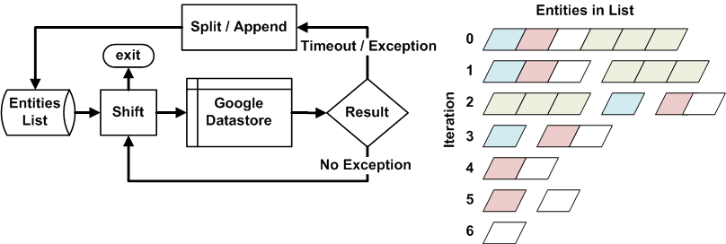
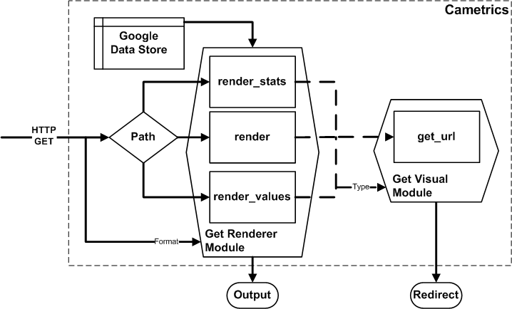
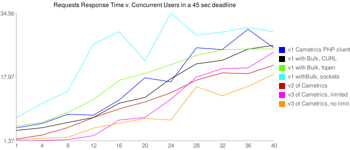
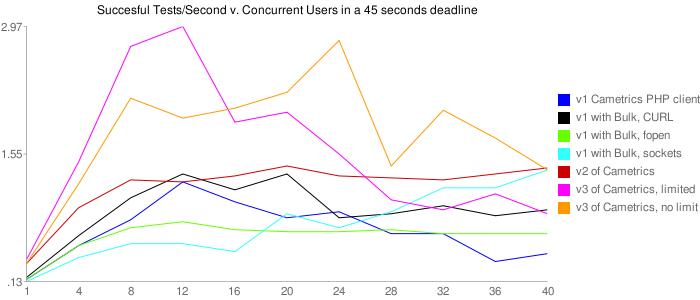

Cametrics: A Novel Data Logger, Aggregator, and Visualizer Cloud Service
------------------------------------------------------------------------
Olmo Maldonado, ibolmo@ucla.edu, UCLA Department of Electrical Engineering

Abstract
--------
Logging and visualization of data collected is becoming practical to implement in many projects due to a growing number of tools and web services. There are difficulties in transferring custom visualizations or measurements between projects, however, because of losing compatibility or a heavy learning curve in understanding the logging and visualization tools. Likewise, the actual logging system, visualization tool, and storage protocols are all separate from each other. This makes management and deployment a consuming process. In order to mitigate these challenges, we propose to standardize the measurement interface, centralize all the collected data, and to format the retrieval and visualization of the measured data. Cametrics, or campaign metrics, does this by providing a developer with client libraries with a simple ``initialize`` and ``measure`` functions. Furthermore, the data is stored in Google App Engine's datastore, which allows the system to scale to demand. Cametrics can also accept any type of data, and is able to return any format that the organizer requests. Cametrics has large support for standard statistical summaries, which can be visualized with Google Charts or Maps API. This paper details the design choices and requirements made to complete the first iteration of Cametrics. Moreover, we discuss the issues, limitations, evaluation, and future work needed for Cametrics.

-------------------------------------------------------------------------------

.. contents::

-------------------------------------------------------------------------------

Introduction
------------
Logging and measuring usage of a system is an important feedback for system debugging and design. A developer can monitor the usage of a website by injecting logging calls inside of their scripts that log to a flat file or database. After some time, the developer creates a script to parse the log and uses third party libraries to construct a visualization of the data. A trend of number of users per month, for example would be a metric to understand if a website is becoming more popular. What if the developer wanted to visualize the geolocation of the user's IP address? The developer has to create yet another script to mine the logs of their web server for all the visitor IP addresses and then geocode the IP address. Then, he would take the GPS coordinates and use another third party service to display the data on a world map. As the complexity of the visualization or requirements of the developer grows more and more, more scripts are created which may eventually become incompatible across projects or difficult to maintain because of the rapid development of the scripts.

This is an ongoing challenge in participatory sensing (coordinated data gathering by individuals, groups, and communities to explore the world around them) campaigns. Campaigns are targeted and coordinated data collection efforts between an organizer (anyone with an interest in coordinating a data-gathering campaign) and a large number of participants of the campaign. In order to manage the campaign, an organizer typically creates a new web site to personalize the campaign for the participants and other guests that might like to join the campaign. Although the act of creating a new website is trivial, migrating subsystems like a logging system are non-trivial due to organizers expertise in the subsystem. Moreover, the original author of the scripts may not be the current organizer of the campaign. Due to the environment of participatory sensing there is a need to minimize the amount of code and settings changes that an organizer must do in order for the system to be a fully functional campaign.

In this paper, we discuss such a participatory sensing campaign: What's Invasive [#]_. What's Invasive is a test pilot campaign that is an effort to equip the National Park Services with GPS-ready smart phones that can be used to map the Santa Monica mountains for invasive species. Invasive species are species that are not native to the area that if otherwise left alone would consume resources, which may endanger the indigenous plants.

Cametrics, or campaign metrics, was created to reduce the complexity in migrating the logging systems between new campaigns and to reduce the amount of code to produce visualization of the data collected from participants and/or the systems that the campaign is running on. After extensive work, and research, we have found that Cametrics' scope is no longer narrowed to just campaigns. Cametrics has become a general-purpose logging, aggregator, and visualization web service that any device that supports the HTTP protocol can use to log data, which can then be rendered as visualization or any other requested format. Cametrics lives in the cloud and is capable of scaling between large numbers of concurrent users. Most important, due to the mission to be simple and flexible, Cametrics is easy to get started and producing visualizations. This is a divergence from other logging and visualization web services. Furthermore, Cametrics is unique in its way it aggregates the data by having standard summarization classes per data type. Cametrics also supports large number of types, which is contrary to many web services, which would constrict an organizer to a fixed set of types. For example, location and GPS data types are now supported and summarized to simplify the organizer's time in understanding the area covered by a participant. If the system does not support a format or type, Cametrics can be easily be extended by a developer contributed classes which will work as plug and play classes. 

In this paper, we discuss related web services that have a similar scope as Cametrics and how they compare. We list the contributions made by this research and how we stand apart from the previous works. The requirements and choices made on the design of the system and the architecture of the system are also included. Lastly, we conclude with the evaluation of the system with quantitative and qualitative measurements and future work that is interesting or are required for Cametrics to move forward.

.. [#] http://whatsinvasive.com/

---------------------------------------------------------------------------------------

Related Work
------------
.. need intro to section

The following table compares other web services against Cametrics. 

.. table:: Web Service Comparison against Cametrics

    +----------------------+----------+-------------+-----------+----------+----------+-----------+
    | Critera              | ManyEyes | TrackNGraph | Mycrocosm | Trendrr  | Timetric | Cametrics |
    +======================+==========+=============+===========+==========+==========+===========+
    | API                  | No       | No          | No        | Yes      | Yes [#]_ | **Yes**   |
    +----------------------+----------+-------------+-----------+----------+----------+-----------+
    | Schemaless           | No       | No          | Yes       | No       | Yes      | **Yes**   |
    +----------------------+----------+-------------+-----------+----------+----------+-----------+
    | Formless Setup       | No       | No          | Yes       | Yes      | Yes      | **Yes**   |
    +----------------------+----------+-------------+-----------+----------+----------+-----------+
    | Formless Entry       | No       | No          | No [#]_   | Yes      | Yes      | **Yes**   |
    +----------------------+----------+-------------+-----------+----------+----------+-----------+
    | Auto. Visual.        | No       | No          | Yes [#]_  | Yes [#]_ | Yes [#]_ | **Yes**   |
    +----------------------+----------+-------------+-----------+----------+----------+-----------+
    | Editable Data        | Yes      | Yes         | Yes       | No [#]_  | Yes      | *Planned* |
    +----------------------+----------+-------------+-----------+----------+----------+-----------+
    | Selectable Data [#]_ | No       | Yes         | No        | No       | No       | *Planned* |
    +----------------------+----------+-------------+-----------+----------+----------+-----------+
    | Shareable            | Yes [#]_ | Yes         | Yes       | Yes      | Yes      | **Yes**   |
    +----------------------+----------+-------------+-----------+----------+----------+-----------+
    | Aggregator           | No       | Yes         | No        | No       | No       | **Yes**   |
    +----------------------+----------+-------------+-----------+----------+----------+-----------+
    | Embeddable           | Yes      | Yes         | Yes       | Yes      | Yes [#]_ | **Yes**   |
    +----------------------+----------+-------------+-----------+----------+----------+-----------+

.. [#] Supports bulk uploads (CSV), individual values, and increment decrement value. Access to the data set with a generated hashed key.
.. [#] Mycrocosm uses a single input form field with a unique Domain-Specific-Language (DSL) for inputs.
.. [#] Automatic visualization occurs for specific options and choices, selected by user.
.. [#] Only supports automatic visualization of a trend chart (line chart).
.. [#] Only supports automatic visualization of a trend chart (line chart).
.. [#] Data source property and delete of the data set are the only forms of data edit.
.. [#] This excludes datum selection (e.g. first, last, by specific timestamp)
.. [#] Note, in ManyEyes all data posted is shared publicly without the option for privacy.
.. [#] Embeds a flash object, which may not be available to the client browser

Criteria
========
The following defines the criteria evaluation.

API
    If the service provides a HTTP RESTful API (independent of the features the API supports).

Schemaless
    If the user, or developer of the system, does not have to define for a data set any unit, type, or attribution in order for the **backend** of the system to function appropriately.

Formless Setup
    If the user, or developer of the system, is not troubled to fill out a form on a website in order for the system to create a new data set, then we say that the system has a formless setup.

Formless Entry
    If the user of the system is not required to manually, submit a form to enter a single value or a bulk of values.

Auto. Visual (Automatic Visualization)
    If the service automatically generates any form of visualization without the intervention of the user or developer.
    
Editable Data
    If the system allows at least edit or delete for a set or individual data.
    
Selectable Data
    If the system has the ability to return to the requestor a subset of the data (with the exception of single values -- first or last value, for instance).
    
Sharable
    If the system has the ability to share the data or visualization between an individual or a group of persons.
    
Aggregator
    If the system has the ability to summarize, or aggregate, the data submitted for statistical understanding. For example, for a number series if the system can return the maximum value passed    
Embeddable
    If the system has the ability to provide the user with a manner to publish to a website or to copy/paste some code into another website without any further user intervention.

ManyEyes [#]_
=============

ManyEyes, by the IBM's Visual Communication Lab, allows the community to take public data sets and visualize them from a slew of available visuals. Due their strong focus on visualizations, they have lacked support many of the criteria. The social and the wide variety of visualization options, however, could and should be implemented in Cametrics in the future.

.. [#] http://manyeyes.alphaworks.ibm.com/manyeyes/

Track-n-Graph [#]_
==================

Track-n-Graph is a tool to track anything about your own personal life. Track-n-Graph depends highly on user's input on the type, unit, and other attributes so that the data set that is uploaded can be visualized correctly. All steps in the flow of the data the users have a critical role. Track-n-Graph's lack of an API, for instance, forces the users to go on their web site to upload bulk sets of data in addition to the user having to setup a schema of the data appropriately before any uploads can occur. 

.. [#] http://www.trackngraph.com/www/

Mycrocosm [#]_
==============

Mycrocosm is a form of microblogging with the use of visualization. Assogba, et. al., had similar objectives with Mycrocosm as Cametrics. Mycrocosm attempts to reduce the time to report/collect the user data by simplifying the user interface to report new data to the system. To enter data a user follows a simple Domain Specific Language (DSL) to denote new data sets or new values for a data set. Furthermore, Mycrocosm appears to be schemaless, which has the added benefit of reducing the complexity of the DSL. For time inputs, for example, the user just has to have 'time' as part of the input string and the type of the data set is automatically associated with time intervals. Unfortunately, they do not have an API or an aggregation (summary) of the data passed to the data sets. 

.. [#] http://mycro.media.mit.edu/

Trendrr [#]_
============

Trendrr takes public data sources and creates trend lines from the data received. Trendrr has custom data input, but is limited to the allowed data types that can be passed. Trendrr also has restrictions on how to select or delete portions of the data. Otherwise, Trendrr follows similar features as Cametrics in that they support an API for client input. This allows a generic device to create a data source stream for *many* others to use the feed for their own purposes. 

.. [#] http://trendrr.com/

Timetric [#]_
=============

Timetric is a tool for visualizing statistical data. Timetric became very close to supporting most of the criteria that would satisfy the requirements for the project. Unfortunately, their focus of their service is strictly on time series events, in other words on number value inputs. Aggregation of the data is also an unsupported feature.

.. [#] http://timetric.com/

---------------------------------------------------------------------------------------

Contributions
-------------
Camertrics is a new take on the data visualization, aggregation, and logging. In all the services, no one attempts to log data as it is being pushed by a script. The only one comparable to that is trendrr but they use public data streams, which do not have the same data rate as participatory campaigns and therefore are difficult to make clear comparison if they can support such a feature. Moreover, some of the services are strict in the type of data that is passed into the system. In contrast, Cametrics accepts any data type as passed by the organizer. If the system does not support the type, it is a matter of extending a subclass and following the interface defined in the parent class. Afterwards the system is capable of supporting the type. Likewise, formats as returned by Cametrics are independent on the limitations of the system. New formats can be added in hours and organizers can contribute their own Renderer classes. By far the biggest contribution is the simplicity in getting started and visualizing the data collected, or being collected. All other services require the user to build the visualization, for Cametrics the visualization is automated and can be customized to fit their needs. 

.. open source project, free, and can be used personally

---------------------------------------------------------------------------------------

System Design
-------------

Design Principles
=================
The design of the system should support flexibility, accessibility, and extensibility principles.

Flexibility
~~~~~~~~~~~
The developer should not have to learn a new language or have formal training on database system design to understand how to create or organize data sets. The system should conform to the developer's own concept of how the data is organized -- be it hierarchical or relational. Likewise, the system should encourage code reuse, simplicity (KISS), and intuitiveness when defining new data sets and recalling values or statistics from the system.

Accessibility 
~~~~~~~~~~~~~
The system should be accessible programmatically and through an interface on a website. In either case, the system should have standard Create, Retrieve, Update, and Delete operations for all data sets, datum, and campaigns. The system should have a 99.9% up time and the responsiveness of the upload and download mechanisms of the site should be responsive so that Cametrics do not bottleneck systems that embeds or pushes data out and into the system.

Extensibility
~~~~~~~~~~~~~
Since campaigns are rapidly being deployed and user requirements per campaign fluctuate per client basis, the system has to have the ability to start with a base class of standard features but be able to support outside development of the system. At each critical stage of the data flow from the input, processing, storage, retrieval, and the visualization should have a standard interface that a developer can use to subclass into a specific purpose that may not have been covered.

Platform Selection
==================
In selecting a platform to build Cametrics, one has a large variety of options that range from building your own personal framework, using a framework solution, or using a cloud service. Although there is great benefit, and practice, in creating your own framework or utilizing a known, and popular, framework solution, which includes an ORM, and a standard DB (which can then be deployed to Amazon's EC2) we found Google's App Engine to be most appropriate for the system.

Home Brew or Framework (Symfony, Doctrine, PostgreSQL) Solution
~~~~~~~~~~~~~~~~~~~~~~~~~~~~~~~~~~~~~~~~~~~~~~~~~~~~~~~~~~~~~~~
The strength in creating an in-house solution by starting from scratch or selecting from a popular solution such as Symfony [#]_, Doctrine [#]_, and PostgreSQL [#]_, is in the flexibility in owning your own system. There's no quota limit, no time limit (assuming you remove execution limit in the programming language configurations -- PHP's ``set_time_limit``, for example), and there's no unexpected platform limitations that we might encounter by using a specific version of a language or missing dependencies due to system security measures by the platform developers. In summary, there are less things that one will be surprised by.

The downfall of a home brew or even using popular frameworks is the learning curve. This is especially true for the home brew system, which has minimal documentation and maintenance support from a community. For the popular framework solution, it is less of a problem because the frameworks tend to have a large and active community to improve documentation and troubleshooting of the system usage and bugs; but due to the large number of framework components one would have to learn multiple tools before one can understand how to troubleshoot errors. Additionally there is no guarantee that the system is scalable or responsive. Due to the prototype nature of most projects, one cannot load the testing environment with stress tests or real world usage. On average, most systems have to go an extensive testing to realize that a large portion of code worked but was extremely ineffective to return results in a responsive manner.

A counter argument would be to use Amazon's EC2 [#]_ to compliment the home brew or framework solution so that it *becomes* scalable. In other words, use more resources only when necessary. While this may be true, we argue that the system is not scalable. The system was simple fed more fuel to consume. Using EC2 will not address the non-scalable portions of the system and will only accrue costs which will then make the service impossible to run for free or without support from the community.

.. [#] http://symfony-project.org/
.. [#] http://doctrine-project.org/
.. [#] http://postgresql.org/
.. [#] http://aws.amazon.com/ec2/

Google's App Engine [#]_
~~~~~~~~~~~~~~~~~~~~~~~~
Almost the reciprocal of the previous platform considerations, Google App Engine has a standard look and feel. The platform runs under Python 2.5.2, and only Python. All necessary packages to run a full-fledge system is already included in the SDK and makes getting started a breeze. This should satisfy a concern that the system may become unmanageable between the number of administrators and developers that shift and join the team as the years and use of the system progresses. Furthermore, the SDK makes the distribution of "Cametrics" as an open source project more appealing for others to use for their own projects to host to other people or domains.

The app engine also has a unique technology not common to the previous platforms: BigTable [BigTable]_. The BigTable has an interesting property that each entity (or record) is unique from each other. One record may have x-number of attributes (or columns) associated to the entity. This can differ from the kind (or table) definition that was defined in a model (schema) file. This is a very appealing property. One of the criteria discussed previously in the `Criteria`_ section is flexibility. If the columns are not fixed and we can create new columns for an object at run time, then this allows us to create decorator modules that receive the records, which then modify the record columns without knowledge of the rest of the system.
.. ^^ may not be done

We are also guaranteed that the system will be accessible and scalable. The deployed application Cametrics, will run on Google's infrastructure and it is very unlikely that their systems will go down without anyone noticing. Outsourcing the maintenance of the system is very appealing because this allows us to focus strictly on the code quality and usage of the system. The site is almost guaranteed to be scalable not because we are in the "cloud" but because we are forced to be scalable. Google has a 30 second deadline that if a script does not finish within 30 seconds all operations seize and a ``DeadlineExceptionError`` is raised and the system has to respond within a few microseconds to handle the exception or the exception will terminate the running code. In the `Limitations and Requirements`_ we discuss other Google App Engine limitations and how they forced a specific manner of designing the internals of the system.

.. [#] http://code.google.com/appengine/
.. [BigTable] F. Chang, J. Dean, S. Ghemawat, W. C. Hsieh, D. A. Wallach, M. Burrows, T. Chandra, A. Fikes, and R. E. Gruber. BigTable: A distributed storage system for structured data. In Operating Systems Design and Implementation, 2006.

Limitations and Requirements
''''''''''''''''''''''''''''
In the process of design and testing of the system, the following limitations became strict requirements.

Deadlines
+++++++++
Google App Engine has a strict execution time deadline. In other systems, one could change the execution time limit to more than 30 seconds, but in Google App Engine, all requests are given a 30-second window to execute. If the request handler script fails to terminate before the deadline, the script is terminated by a ``DeadlineException`` exception. Simple optimizations can lend a big hand to reducing the latency of a script. For example, maintenance of your code and keeping it simple and with minimal dependencies has an immediate benefit in the execution time. For example, the first iteration of Cametrics all critical paths used Django 1.0.2 framework (in Google App Engine SDK, Django 0.96 is available) to handle requests. Because the 1.0.2 version of Django is not included in the SDK, a separate ``.zip`` archive of all the Django files is used in order to pass the 1000 files allowed in an application requirement. At every request, the zip file had been unzipped and loaded onto the Python runtime so that the framework can properly handle the request. This meant that every request had a fixed cost of a few seconds. Although this was not a big concern in the processing, other issues will be discussed in this section, a few seconds can be saved by removing this dependency from the critical paths. In a newer iteration of Cametrics, the POST and GET of data paths have been regressed to only use native SDK environment. As a result, GET operations are taking milliseconds in response rather than seconds. The difference is very apparent to a user. 

Quotas [#]_
+++++++++++
Everyday an application under the Google App Engine platform has to execute within a certain quota that is limited per day and per rate. For example, the CPU Time spent in a day may not exceed 46.30 CPU hours. Requests, for example, may not exceed 133328 requests in a day and cannot exceed 500 requests per seconds. Understandably these quotas and requirements are set to prevent system overloading and for ensuring equal share of the platform. 

With billing enabled, these limits may change and daily limits are increased. For example, the requests allowed in a day can change to 43,000,000 requests and the rate allowed is now 30,000 requests/minute. From speaking to a Google App Engine developer in the bi-monthly Internet Relay Chat (IRC) sessions, even enabling the Billing without a set budget has an immediate impact on the system performance. More tests are needed to verify this claim.

However, even with billing enabled there are fixed requirements that a developer must obey. File count limit, for example, states that an application may not have more than 1000 files in an application. This prevents users using the App Engine as a data warehouse. Likewise, one cannot exceed 1 MB per record size in the datastore. There are many more quota limits and many more hidden, or at least not well outlined, that an application has to follow.

Even with these requirements, a developer learns how to adjust the design of the system and perhaps it is warranted to claim that out of necessity a stronger and faster system is built. 

.. [#] http://code.google.com/appengine/docs/quotas.html

Timeouts
++++++++
After deploying Cametrics and a few number of users of the What's Invasive campaign started contributing data to the campaign, we noticed a large number of Deadline Exceptions. After some investigation, we found that there were two reasons for this occurrence. First, the number of data points passed to the system was well over 50 records. For each record a statistic and histogram record, needed to be retrieved or created from the datastore. These retrieves or creates per 50 records has an immediate toll on the execution time. Moreover, for each of the 50 records and any modified statistic or histogram record each had to be saved to the datastore before the execution would finish. Evidently pulling, updating, and saving per record was an efficient design choice. This has since been modified and now the goal for this critical path is to reach a near 1:1 ratio (meaning for 1 data record, 1 put or save transactions required). This is discussed further in the `Input Processing`_ section.

What we were soon to discover, however, of doing a 1:1 optimization was that the datastore is sometimes incapable of storing large number of modules in one transaction. When we attempted to save 1000 and more entities in one transaction (using a single ``db.put`` with a list, or array, of 1000 entities) a sudden rise in ``Timeout`` exceptions. After doing some research, this is yet another one of those limitations by the Google App Engine that has not been underlined by any documentation. The responses to the ``Timeout`` exceptions in the Google Discussion Group for the App Engine, the Google Developers suggest that this may be due to internals not responding on time to save the entities and that the current solution is to "try again." As a result, a new algorithm that attempts to save all the datastore was devised and further discussed in the `Input Processing`_ section.

Instabilities
+++++++++++++
Similarly to the ``Timeout`` exceptions, another unexpected exceptions were being raised when we wanted to wipe the datastore (Google App Engine) of all the data that had been saved in one day. In particular, we were anticipating large volume of data from the campaign and we wished to have a clean datastore to so that we can understand the impact of a real world usage on the data store. Although these timeouts were of no severity, since we were Bulk deleting the data, we soon found out that there is collateral damage when doing bulk delete on the Google datastore. After some time of deleting all the data, we were soon pressed to find that the site, and system, were behaving erratically. After some investigation, other developer have reported incidents that after massive deletions of the datastore their system became unstable and that only after a large period of time did the system start to behave as expected. This is an ongoing issue for the Google App Engine developers, and our only solution is to be more careful with the data that we upload to the application. As a result, a separate application has been created (``cametrics-stress``) to be used a testing and staging environment. We found that after 4 days of allowing the Cametrics application to have 0 data contributed (we used cametrics-stress as a temporary datastore), that on the 4th day we found the system to start behaving correctly by showing some data that did not get deleted correctly.

Inputs
======
As discussed in the `Flexibility`_ subsection, the allowed inputs to the system should have minimal restrictions and low number of requirements for the user can start to measure (log) data to the System. The formats allowed as inputs should also accept various popular formats like CSV, JSON, or at the root of the allowed accepted values a simple ``POST`` with multiple or single value for the ``value`` field.

Required Outputs
================
At a minimum, the system should return the logged data and any summaries/statistics that were computed as the data had arrived in the requested format provided by the user. Additional formats, or allowed outputs, should include images for Charts and JavaScript objects for easily populating a Google Maps API. These are the typical tools used by researchers to visualize statistical data as well as representing a location trace as a polyline or a series of GMarkers for marking specific points in the path. As discussed, the output should support extensibility principle and have an accessible interface for a developer to contribute their own output format for others to use for their own projects. Moreover, the objects that can be selected for the output should be accessible without the use of client software and to select the format of the output should not require the user to have a client for the system to return the data in the requested format.

Processing
==========
There are three processing stages that should occur: preparing, calculating, and visualizing the data. The prepare process should clean and validate the input to the system. The calculations that are executed, according to the type of data, should produce, and update, a summary of statistical information for that data. Lastly, the developer will use the summaries or the values of as they were logged or cleaned by the system and a visualization process should represent the data in the requested format and representation by the user or developer.

Proposed System
===============
Cametrics is the culmination of addressing all the previous design and user requirements. Cametrics provides other developers with a base class for Summaries, Rendering, and Visualizations, which should cover most use cases, but if necessary, the system has the ability to accept developer contributed classes and should adapt naturally without internal modifications. Because the system runs in the Google App Engine, the system can be accessed with an uptime of at least 99.9% and the infrastructure will scale (up to the quota limits) without system developer's intervention on the system. Furthermore, App Engine simplifies the deployment, development, and contributions of the system. The development and external developer's contributions are simplified due to BigTable's unique property of having a flexible (schemaless) entity definition which would allow entities (records) in the system to be decorated with additional attributes (columns) by the Summary modules that are applied to the type of data passed to the system. Additional details of the running system in the `System Architecture`_ section of this paper.

---------------------------------------------------------------------------------------

System Architecture
-------------------
To best describe the architecture, we will use a concrete example. At this time a participatory sensing campaign, What's Invasive [#]_, is using Cametrics to provide the participants with feedback in the form of statistics of their number of contributions, the coverage of the area by the participants, the variety and quantity of the invasive plants that have been discovered, and more. The objective of the What's Invasive campaign is to empower the National Park Services in the Santa Monica Mountains with new tracking and discovery technology against invasive species. An invasive species is a species that is not indigenous in the area and that are consuming resources from native species.

Campaign participants run a campaign client called Campaignr [Campaignr]_, which posts sensor data (GPS, tags, and images) to an organizer's script on their web server. For demonstration purposes, the organizer's script is using the Cametrics PHP Client, but this step may have been unnecessary if the organizer had prepared the Campaignr client to post appropriately to the Cametrics server using HTTP methods. In the organizer's script, Cametrics is initialized with a ``secret key`` (given to the organizer when they author a campaign via the Cametrics website -- the only required step before they can begin using Cametrics). The organizer's script will process the data and call the static ``measure`` function to log a value to Cametrics. This value may be a number, string, location, datetime, and many more. See the discussion in the `Input Processing`_ subsection for more information. At the end of the PHP script, all the recorded data is ``POST``-ed to the Cametrics server. Cametrics then processes the input and calculates summaries, which can be used immediately after the request. The organizer's website can then include the visualization by requesting to the Cametrics server for the namespace, path, and format of the data. For example in the following figure, the organizer's website is requesting that Cametrics provide all the ``values`` that have been posted to the ``namespace`` entries with the ``gc`` (Google Charts API) format.

.. figure:: system_overview.png
    :scale: 50
    :alt: System Overview figure
    
    An overview of a simple participatory sensing campaign using Cametrics.

.. [#] http://whatsinvasive.com/
.. [Campaignr] http://wiki.urban.cens.ucla.edu/index.php/Campaignr

Structure
=========

URI Format
~~~~~~~~~~
Cametrics follows a strict, but flexible, URI format/pattern to access all the data sets, summaries, and visualizations stored.

``.../namespace[/path[.format[?query_string]]]``
    
namespace:
    The namespace is synonymous to a nickname created by the organizer. This is contrary to timetric, trendrr, and other web services that allow the user to create their own data sets because these services return a hashed key for the created data set. The hashed key requires the organizer to keep a mapping file/script or to use the service's web site to associate a key to a data set. A namespace is an unencoded text; the namespace has representation and a meaning for the organizer. For example, a simple namespace of: ``'participant.visited'`` is easy to remember and understand. Furthermore, an organizer can use the ``participant`` to keep all things that related to the participant together. For example, a namespace of ``'participant.trace'`` defines a relationship between the trace data and to the participant. Moreover, an interesting future work would be to relate data sets across multiple campaigns/projects by using the namespace and history of the namespace usage (formats requested, visualizations rendered, and most used objects of the data set) in order to optimize retrieving of data sets.
    
    Even though the example states that the user can use ``participant.visited``, but correct to access the namespace with Cametrics is to convert any combination of non-alpha numerical character into a single ``/``. For example, ``participant.visited`` (as entered through the PHP client) would be accessed through HTTP with ``participant/visited``. This is also the case for ``participant::visited``, which would result in: ``participant/visited``. This restriction may be removed in the future.
    
path:
    The path is an accessor mechanism into the data set. The path is best described with a series of examples. Assuming the namespace is ``'participant.trace'`` and type is ``'location'``, the path of ``values`` returns all the location values stored on Cametrics. The path of ``stats`` returns all the statistics calculated by the summary modules that matched the type of the data set. The path of ``stats/min.longitude`` returns a single longitude value (useful for knowing the boundary of the data). Path of ``stats/geotudes/37561.91.68.99.62`` returns the total number of GPS locations that are inside the Geotude [#]_ box (useful for understanding area covered by the participant). 
    
format:
    The format similar to file extensions in a file system. By appending a ``.json`` to a path, Cametrics returns a JSON [#]_ formatted object. The `Renderer`_ modules define supported formats for Cametrics and have a simple interface for an external developer to contribute their own formats. For the What's Invasive campaign, for instance, a request was made to support rendering location values into a Google Maps API [#]_ ready objects, such as polylines or markers. By overwriting a few of the base classes that ``Renderer`` module provides, we were able to transform the location traces from one representation (a Python dictionary) into a JavaScript string that uses the Google Map API's ``GMarker``, ``GLatLng`` and ``GPolyLine``.

query_string:
    The query string is the analogous of passing arguments to a function. Each argument is passed along the Render and Visuals modules. More documentation is available on the website [#]_, but as an example using the ``.gchart`` format and a ``query_string`` of: ``?cht=p3&chs=250x100&chco=054700`` informs the Google Chart Renderer that the object should be represented as a 3D-pie chart (``p3``), the size of the chart should be **250** by **150** pixels (``chs``), and the color of the chart (``chco``) should be **#054700**. Notice that the parameters are exactly as if someone was using the Google Chart API directly. The Google Chart formatter happens to generate a URL with the data (``chd``) and other data dependent parameters like the x- and y- labels. Having to provide a ``query_string`` is a bit convoluting, so most formatters have default options. A future work would be to adjust the default parameters by how organizers (or participants) like to view their data by following the system usage.    
    
The following is a complete example of a possible URL that Cametrics supports: 

    ``http://cametrics.appspot.com/measure/public_key/participant/visits/stats/weekday.gc?cht=bhs``

This will use the ``participant.visits`` namespace, and access the statistics (``stats``) calculated for all the datetime (defined in the statistic object, or the data) entries and return a stacked Google Chart's (``gc`` an alias for ``gchart``) bar graph of all the weekdays (Sunday through Saturday) that the participant has visited the website.

With exception of ``path`` and ``query_string``, Cametrics also uses the URI format to accept HTTP POST. For bulk uploads, Cametrics currently only accepts bulk uploads POSTs to an empty ``namespace``.

.. [#] http://www.geotude.com/about/nutshell
.. [#] http://www.json.org/
.. [#] http://code.google.com/apis/maps/
.. [#] http://cametrics.appspot.com/

Modules
~~~~~~~

Models
''''''
The models module contains all the kinds (models) known to Cametrics: Campaign, Storage, Statistics, and Histogram. Each of the models are subclasses of the SerializableExpando (a subclass of the ``db.Expando``, from App Engine), which has the ability to transform the models into ``JSON`` or Python dictionaries. 

The Campaign holds all the campaigns known to the system. This is equivalent of a project. There are no limit to the number of campaigns that an organizer can create and the campaign are strictly for separating the datasets from each other -- so that there are no namespace collisions -- and for other attributes that make up a campaign: title, description, and homepage. 

The Storage model houses all the data with campaign, namespace, type, created_on, and stats attributes (columns). Although the statistics for a data set is unique to each namespace, the Storage entities have a referenced property to their statistics to reduce the number of requests to the datastore and to simplify the development in the other modules (in particular the Stats module). 

The Statistics holds all the statistics for a campaign and namespace. The stats module will either get or create a statistic entry based on the campaign and namespace combination. The only defined attributes are the campaign, namespace, count, and histograms. The count is the only mandatory statistic because of its use in other statistics (for example calculating the mean of a number) and organizer's own tracking.

Histogram model is similar to the statistics model because there are almost no attributes attached to the model. The histogram has a statistic and name attributes which when combined produces the key to the histogram. The stats module will try to tally all occurrences to various histograms. If the histogram is not stored in the datastore, the tally function will add a reference to the statistics, create the Histogram entity, and increment the count in the index (attribute) of the Histogram. For example in the string summary class, a 'hits' histogram is attached to the stats entity for the namespace. If the string of the value passed to Cametrics has not been seen before, the Histogram entity (created or retrieved) gets a new attribute as the value. Then, the histogram attribute is incremented to indicate that the value has been seen before. The next time that Cametrics received the exact (case sensitive) of the value, the value for the histogram attribute (of the passed value) will be 2. 

Stat
''''
The Stat module contain all the Summary classes known to Cametrics: NoSummary, Summary, NumberSummary, StringSummary, DatetimeSummary, and LocationSummary. All Summary classes must have a prepare and calculate method which are called for each datum in the data passed to Cametrics. The prepare method primarily converts the value passed to the system into the expected format. This is particularly important to datetime and location summaries. The DatetimeSummary and LocationSummary normalize the raw string by adding to the datum two new attributes: timestamp, datetime and longitude and latitude; respectively. This allows for the calculate method and other subclasses of these classes to have a standard interface to access from the datum. If an exception is thrown, or the datum cannot be prepared for processing, the datum is invalidated and removed from the input processing pipeline.

All Summaries subclass NoSummary. NoSummary's prepare method simply assures that the datum entity passed has a value attribute (the raw value) and that it is not empty. The calculate method increments the statistic's count by one. The NoSummary also defines other helper methods such as invalidate and tally. The invalidate method adds a private attribute, ``_valid``, that is used by the pipeline stages to remove the datum from being saved into the datastore. The tally method is a helper for the the histogram classes. This reduces the need to understand the intricacies of Cametrics model design. The required parameter are the statistic entity and the name and index of the histogram that needs to be incremented.

NumberSummary's prepare method converts all expected numbers to its appropriate type. Note, however, that integers stored in the datastore become long integers. This is the normal behavior of the datastore. The calculate method, currently, adds a min, max, sum, and mean to the statistics. The min and max are continuously updated if the value is less or greater than the min and max values, respectively. The sum and mean are accumulated and computed for the running sum and average of the data series. The NumberSummary matches any of the following types (as provided by the organizer in their scripts): number, float, int, integer, long.

StringSummary inherits from the Summary class, which keeps a tally of all the values passed. The StirngSummary matches all: str, string, and text types passed. The prepare method ensures that the system can properly parse the value passed into a string.

DatetimeSummary accepts date, datetime, and timestamp values and normalizes the datum entities with the timestamp and datetime attributes so that the calculate method and other subclasses can properly work with the datum. The calculate method creates a number of interesting histograms: years, months, days, hours, minutes, seconds, weekdays, dayth, weekdayth, hour.weekday, day.hour, and weekday.month. Each of these are just counters for the the series of the data passed to Cametrics. From these buckets one can discern the most active months, hours, minutes, weekday (Mon.-Sun.) and even seconds (although this may be removed if we find that this histogram is rarely used). The dayth and weekdayth buckets are histograms for day and weekday in the year. After a year this can provide a clear picture of a trend in contributions. The hour.weekday, day.hour, and weekday.month have special meanings. The hour.weekday is a timecard that can be visualized with a bubble scatter plot. The size of the bubble is the value at the hour.weekday, and the indexing to the chart is done by the '.' separated values. For example, ``'8.1' = 2`` indicates that there were two events that occured at 8 am on Monday (``1``). This is similar to the other ``'.'`` separated attributes.

LocationSummary accepts location and gps type inputs. For each data passed, LocationSummary prepare normalizes each datum entry with longitude and latitude. In the calculate method, we are currently augmenting the datum entry with a min, max longitude and latitude for creating a boundary of the data set. Moreover, the calculate method adds a geotudes [#]_ histograms which up to 7 grid resolutions. For example, an input of ``-118.44271302223206,34.06945813747638`` would have up to ``37561.95.35.07.52.48.16`` indexable values.

Currently the system does not support Intervals (start and stop timestamps), will soon be added due to its importance.

.. [#] http://www.geotude.com/about/nutshell

Renderer
''''''''
Renderer classes have a very similar interface to Summary classes in order to minimize the complexity in developing new subclasses. The Renderer classes that are currently supported: NoRenderer, Renderer, GChartRenderer, and GMapRenderer.

The NoRenderer defines the interface that all other renderer classes should use. The ``get_values``, ``get_statistics``, ``render_values``, ``render_stats``, and ``render`` are all the functions that the subclasses may need to override. By default, the ``get_*`` methods return empty list and dictionaries. The Renderer class override the get methods for centralizing a single point to get the values and statistics. 

The JSONRenderer matches the JSON format, and converts all values into JSON ready objects by replacing the datastore specific types into types that can be simplejson [#]_ can convert into a JSON string. Additionally, the render method returns a JSON object with the values and stats if the path is empty. Otherwise, if the path is stats or values it returns the JSON object for the object as described in the `URI Format`_ section.

The GChartRenderer matches gc and gchart formats and redirect the user to a generated url as specified by the Google Chart API. Similar to the JSONRenderer, the GChartRenderer converts the values and stats into dictionaries or objects that the Visualize module can accept. The Visualize module then has the logic necessary to transform the object passed to it (either a list of values, statistic dictionary, or an object within the statistic).

GMapRenderer matches gm or gmap formats and currently only support the rendering of values. Using the ``type`` parameter in the query string (see `URI Format`_) the GMapRenderer renders the values as a JSON list (when type is ``raw``), a JSON dictionary for an encoded polyline (when type is ``encoded``), a GMap API-ready encoded polyline (when type is ``polyline``), or as a GMap API-ready markers (when type is ``markers``). The last two cases follow a simple example [#]_ [by the Google Map API. The GMapRenderer also supports ``callback`` and ``class`` parameter in the query string which will format the string returned by the renderer to do a standard JavaScript function call with the first parameter as the object returned, or similarly to use a map class to directly add the overlay (polyline or markers) directly. 

.. [#] http://undefined.org/python/#simplejson
.. [#] http://code.google.com/apis/maps/documentation/overlays.html#Encoded_Polylines

Visualize
'''''''''
The Visualize classes follow the same pattern as the previous classes. The classes currently supported by Cametrics to visualize the data are:  NoVisual, Visual, NumberVisual, StringVisual, DatetimeVisual, and LocationVisual. The Visual module uses a third-party Google Charts API Python Client pygooglecharts [#]_ to minimize the load on the developers to derive helper functions to generate a url. The NoVisual class has a simple interface: ``get_url`` and ``add_labels``. The Visual class overrides the ``get_url``, and its purpose is to get the correct chart according to the ``cht`` parameter passed in the query string, and to set the values and keys that the chart needs to add as the data and values for the chart. Lastly, it generates the url and appends all non-visual specific parameters to the resultant url. This in effect opens the Google Chart API for the organizer or user to modify at their leisure without having the Visual classes to reproduce the same behaviors. For example, one can pass the chart color parameter (``chco``) and the Visual classes will ignore this parameter and the Google Charts API will do the necessary work so that the chart uses that color scheme.

The NumberVisual which matches the same types as the NumberSummary types, simply overrides the ``add_labels`` method so that the order and position of the values and keys are appropriate when visualizing numerical data.

The other visual: String, Datetime, and Location, lack a complete implementation and currently behave as a NumberVisual. The Datetime visual will soon incorporate visualization for timelines and support for the '.' separated histograms like the ``hour.weekday`` histogram (a timecard [#]_).

.. [#] http://pygooglechart.slowchop.com/
.. [#] http://dustin.github.com/2009/01/11/timecard.html

Client Libraries
================
At this time, Cametrics has released a PHP client. Python and JavaScript clients are next to being released. The two main functions of the PHP client are ``initialize`` and ``measure``. The ``initialize`` function's first argument is the ``secret_key`` as given by the Cametrics website in the campaign details page, and the second argument is for modifying the default options that the client uses like changing the hostname (typically, for local testing) or modify the request size required before the client can post to the server. 

Bulk Uploads
~~~~~~~~~~~~
The early development of the client ``POST``-ed to the Cametrics server at every ``measure`` call. This seemed appropriate when testing locally, but one of the lessons learned from working with the Google App Engine, is that doing a request per every call of ``measure`` does not scale. For example, the What's Invasive logging script file has 8 measurements. At 8 requests per execution, PHP began to limit on the amount of memory and resources that the system can consume. As a result, the client and Cametrics were modified to allow bulk uploading. In this manner, the execution of the script would only request at the end of the script execution. This reduced the latency of the script. The results are shown in the `Evaluation`_ of Cametrics.

Request Size
~~~~~~~~~~~~
In addition to the bulk upload feature that resulted out of too many requests to the server, another emerging problem was exceeding the deadline allowed for an execution of a python script on Google. See `Limitations and Requirements`_ for more information on the deadline exceeded exception. As a temporary work around, the PHP client trades, reduced latency for guarantee that the data passed to the server is saved. Notably, this should not be something that a client library should be concerned of, but until a more permanent solution is in place on the Google App Engine -- like immediately saving any unsaved Python objects to Memcached before the script is terminated -- the client reduces the amount of data Cametrics has to process.

Input Processing
================

.. figure:: input_overview.png
    :scale: 50
    :alt: Input Processing Overview
    
    An overview of the input processing pipeline as data is received by Cametrics.

Framework of Input Processing
~~~~~~~~~~~~~~~~~~~~~~~~~~~~~
As illustrated in the figure above, during a HTTP POST to the system the participant's data will be processed in a pipeline fashion. For each value a datum (Storage) entry is created (but not yet pushed to the datastore) and the datum entity (now an actual Storage entity) is prepared by the correct `Stat`_ module which will augment the entity if necessary. During the calculate method of the stats, the necessary statistic entity and histogram entities are created and incremented. 

After the datum passes through the processing (without an invalidation from the prepare method) the data is stored in local memory (in a Python list). The created or retrieved statistics and histograms are also kept locally in two separate data structures. The first, a global private variable ``_STATS`` is a dictionary indexed by the statistic's key (or generated key by using the campaign key and namespace value -- important to prevent unnecessary datastore transactions). Likewise a ``_HISTS`` global private variable exists for all the histograms that are retrieved or created. On the next datum, the storage entity is created but the stats and histograms are checked if they exist locally in the ``_STATS`` and ``_HISTS`` data structures to be reused and updated. This had a significant decrease in the latency for input processing. Discussion on the evaluation of Cametrics in the `Evaluation`_ section.

After all the data is processed and is waiting to be saved, the send to datastore combines all the data, statistics, and histogram entities into a single list. As mentioned in the `Limitations and Requirements`_ subsection we were surprised that we could not put a large (over 500 entities in a list) into the datastore in a single transaction. Due to the timeout exceptions that were raised by the datastore, the Send to Datastore method had to be redesigned so as to prevent that the complete transaction from being rolled back -- and preventing any data from being saved.

    
    Pictorial explanation of the send to datastore algorithm and an example of an erroneous entity and how the algorithm adjust against it

Likewise, we found that if an entity could not be saved, for any particular reason, into the datastore then the complete set of entities would be rolled back. The above figure demonstrates how the most current send to datastore algorithm works. A while loop that terminates if the entity list is empty, shifts the first entity (initialized to the complete entity list as previously mentioned) into a current variable. The current set of entities is then attempted to be stored into the Google datastore. If the datastore does not raise an exception then the loop continues. Otherwise, on an exception (timeout, or otherwise) the current data set is split in half and the entities list is appended with the first and second half of the last current set. In the next iteration of the loop the first half, or any other set previously in the list, will then be attempted to be put into the datastore. This continues until all the entities have been saved.

In the case that there is an erroneous entity in the data set, the algorithm is capable of withdrawing the datum from the set after a series of iterations (if the length of the data set is one, the datum is removed). The datum is logged and used later for further testing. As shown on the right of the above figure, the complete data set could not be put to the datastore because of the red malicious entity. The set is split and appended to the empty list (since it was the first iteration, and the complete set was shifted out of the list). In the second iteration, the first half of the original set will still be unable to be stored in the datastore, and further split. In the third iteration, the second half of the original set will be stored and this pattern continues until the fifth iteration when the erroneous data set (now length of 1) will be discarded and the iteration continues to store the last (white) entity.

In the future, we wish to minimize the number of iterations. For large quantity of entities in the list, the large number of iterations may cost (in time) more than then if we had saved each datum at a time. We can reduce the number of iterations by diving the sets more appropriately to the observed maximum length of set allowed. This can be done by analyzing the history of the most allowed number of entities saved (discussed in the `Evaluation`_ briefly) and dividing the complete set into n-number of maximum allowed stored length. This system information can be stored in the datastore or persistently in Memcached. 

Output Generation
=================

    
    An overview of the output generation

Framework of Output Processing
~~~~~~~~~~~~~~~~~~~~~~~~~~~~~~
For all HTTP gets whose public or secret key retrieves a campaign the path (after the namespace, see section `URI Format`_ for more information) is used to execute one of the methods provided by the Renderer module. Note that the format requested in the URI selects the appropriate Renderer module. Depending on the Renderer module, the object returned from the Renderer (varies between the function called) will be passed to the Visual module that is selected by the type of the object resultant from the Renderer module.

The objects that may be returned by the Renderer module are as follows:

render_stats:
    This may be the statistic entity, or dictionary, for the namespace and campaign. The object may also be a value or dictionary (for Histograms) within the statistic object.
    
render_values:
    This is strictly all the values stored in the datastore. In the future, this can be a range of values or single values. Moreover, it would be appropriate to return a resolution of the data. 
    
render:
    Depending on the Renderer this may return the values of ``render_stats`` and ``render_values`` plus the type of a data series.
    
The Renderer may then write the output to the stream and if necessary, the Visual module may redirect the request to a permanent URL for the URI given. For more information on the construction of the output or URL for the redirect, refer to the `Renderer`_ and `Visualize`_ sections.
    
The first design of the output processing did not separate the paths into the three aforementioned paths. After a long series of values had been stored in the datastore, we noticed that too many Deadline exceptions were being thrown. As a result, we have elected to only retrieve from the data when and if it is necessary. Moreover, the current paths do not reflect a pipeline structure. The next iteration of the visualization framework should follow this so that a single iteration is necessary to prepare a datum into visualization.

The current performance of the output (the limits), is yet to be fully quantified but some statistics of the current performance is provided in the `Evaluation`_ section.

---------------------------------------------------------------------------------------

Evaluation
----------

Test Setup
==========
Using two computers:
 - **client**, a (separate) computer that acts as multiple users sending multiple ``POST`` to the *server*
 - **server**, a (separate) computer that receives the *data* from the *users/clients* and will ``syslog`` and ``Cametrics:measure``

Client Setup
============
The client is on a **separate** network than the sever and is using the FunkLoad functional and load web tester [#]_ tool to simulate the user/device.

.. [#] http://funkload.nuxeo.org/

Server Setup
============
The server is dedicated to the tests and *not* running/hosting any other project.

Server Specification:

|    CPU: Intel(R) Core(TM)2 Quad CPU Q8300  @ 2.50GHz
|    Ram/Memory: 512MB
|    Disk Space: 20GB
|    Bandwidth: 1500GB

The server also has the FunkLoad Monitor Server [#]_ to monitor the health of the server to understand the different load the system has with and without the use of Cametrics.

.. [#] http://funkload.nuxeo.org/#monitor-server

Results
=======
The following results summarize the average response time and the number of requests per a 45 second deadline. We do not compare the ideal case (using ``syslog``) because the charts would not be of significance. In comparison, the ideal case performs linearly to the number of concurrent users on the system. In the other hand, as seen below in the graphs server (the machine sending measurements to Cametrics) exhibits a worsening of performance as the number of concurrent users increases.

Now, the What's Invasive campaign needs to support 9 participants and the worst case of 40 concurrent users is a very unlikely condition. When looking at the following charts, however, it is best to treat the typical case in the range of 4-12 concurrent users. 

    Seven average response times against a varying number of concurrent users.

    
    Successful requests per 45 seconds against various concurrent users for seven different test cases

v1 Cametrics PHP client:
    This is the first iteration of the PHP client (using CURL). In this version, the client does a POST on each time the script executes the ``measure`` function. As discussed before, we saw the worst-case performance in this version because of the large number of requests occurring.
    
v1 with Bulk, Curl:
    This is an optimization to the PHP client in that the only POST made to the server is one massive upload of all the data collected when the script finished execution. As seen this showed some improvements in the response time but the number of requests per 45 seconds is still in the lower end of the results.
    
v1 with Bulk, fopen:
    Looking at the successful tests/45 second graph this and the next test case were used to compare if the performance of the client depended strongly on the function used to send the HTTP post. We compared the CURL, fopen, and sockets. The fopen seemed to be worst in most of the range of users. This is especially true after 12 users. We expect this to be as a result of PHP limits on the number of concurrent fopens allowed per system.
    
v1 with Bulk, fsockets:
    Sockets are the lowest implementation to the stream of data. We found sockets to be the least performing of the three test cases. It is unclear as to why this may be the case. From the results, the current version of the client (and following tests) use the CURL function to upload the data.
    
v2 of Cametrics:
    This is the single transaction for bulk uploads optimization done on Cametrics (not the client). As seen the client has an immediate benefit in the response time. Other optimizations were to separate the POST critical path from the Django (zipimported) path. This immediately has a reduction in the latency, as seen from Cametrics. 
    
v3 of Cametrics, limited:
    Version 3 of Cametrics indicates that this version has the newest algorithm of the send to datastore that had been previously mentioned in the `Framework of Input Processing`_ section. The limited indicates that the Cametrics PHP client is limited in the ``request.size`` as discussed in the `Request Size`_ subsection. At the time of this test case the client was limited to 25 data points. This meant that the test case might have POST to the server more times, than if the client had not been limited.
    
v3 of Cametrics, unlimited:
    In order to understand the request size implications, we created a last test case to understand if the increased number of POST requests to the server had reduced the performance of the PHP client. As seen from the charts, the best performing test case is this case. As a result, the PHP client should be simplified to not have to deal with the deadline issues on the server end.
    
As seen from the ongoing stress tests, the server is the direct effect as to how fast the PHP (and the other clients in other languages) client will perform. First, the optimizations that have been described in this paper had a significant improvement on the performance of the client. Second, the limits imposed on the client in order to ensure that Cametrics does not raise a Deadline exception do show a negative effect on the performance. This requires further investigation on Cametrics' POST critical path and to ensure that it returns a 200 status code (or ``ACK``) to the client so that the client can return finish as soon as possible.

Developer Survey
================
Although the number of developers currently helping to test is small the survey does answer and raise some questions of the project. 

When asked, "what was the most difficult concept to understand of Cametrics," there was disparity in the responses but one of the developers indicated that the concept and purpose behind Cametrics was not easily understood. From other responses in the survey, the namespace and type concept were not clearly understood by some of the developers. This indicates that the project has not done a good job in documenting, giving examples, or provides enough guideline on how to understand the capabilities and limits of Cametrics.

The rest of the responses, however, indicate that Cametrics is shown to be flexible and responsive. When asked, "What is the Cametrics' best feature" overwhelmingly the Summaries and Statistics were chosen as the best feature. Coming in second were the flexibility and visualizations of the system. Even though one of the organizers indicated that the concepts were not understood, they found that it was not difficult to setup (about 1-10 minute estimated setup times) for the organizers.

As shown in the previous evaluation, the stress tests do indicate that Cametrics may seem to be slow or unresponsive. When asked, "How is the "feel" of the system ..." for uploading and accessing the data, the average response showed about 2-3 second wait time. The uploading of data seemed more responsive (according to one of the organizers) and this may be because of an ongoing analysis and optimization on that critical path. More investigation and test cases are needed to understand why the developers showed that Cametrics had a 2-3 second response for accessing the data.

When asked, if they "intend to continue using ..." and if they would suggest to their friends to use Cametrics, an overwhelming response of yes from all the developers indicate all the organizers approve that project as a tool that may have a significant part in their projects. As such, it is warranted to keep optimizing and improving the summaries.

---------------------------------------------------------------------------------------

Conclusions
-----------

The project thus far is successful in being simple, flexible, and extensible. The organizers have indicated in the surveys that it took them less than 3 minutes to setup and start logging data. Moreover, the organizers spent about the same time to embed on their web pages. Cametrics is flexible by allowing the organizer to set their data set key (the namespace) as they would like without having to have a mapping between a hashed key to their data set. Moreover, the system already accepted a large number of input types: string, integer, float, long, datetime, timestamp, location, gps, and more planned. All of these have summaries and histograms that automatically have visualizations that the organizer can use on run time. A feat. not yet possible with any other service. Although Cametrics has had a run in with scalability issues with the Google App Engine, learning from the difficulties has improved the design of the system and the future work will improve even further what Cametrics has already succeeded in doing well.

---------------------------------------------------------------------------------------

Future Work
-----------
Because Cametrics is a generic logging, aggregator, and visualization platform there are many features that have yet to be implemented. Moreover, the organizers of the campaigns already have a running list of requests that would make their development lives even easier. This section outlines a few of such requests and plans for the future of Cametrics.

Filtering, Granularity, and Selecting Data
==========================================
An ever-growing request is to select particular data from the data set -- the first and last collected data, for example. Additionally, a date range of when it was created would improve responsiveness since this could reduce the amount of processing on the GET critical path. Other improvements would be the granularity of the data. This is a tougher order to server, however, since Google App Engine does not allow complex queries in their query language. The best one can do is to define bookmarks in the data set for certain granularity. When the granularity is requested, one would iterate for all the bookmarks that match the granularity (which reference the entities that match the bookmark). Thorough testing is needed to ensure that the processing is not too strenuous on the system.

Summaries of Summaries
======================
Pardon the confusion. An example should help make this idea concrete. At this time, Cametrics adds a created_on attribute for each of the datum that are ``POST``-ed. Summaries of Summaries would mean that the created_on would not be an additional attribute on the datum, but rather an additional data set automatically created for the datum. This would mean that there would be a direct association between the ``namespace`` that the user used to POST the datum, and the ``namespace.created_on`` that Cametrics would automatically create for the user. More needs to be researched in how these associations would occur (because of the complexity in the queries), and how the responses by the Renderer and Visualize modules should behave.

Event System
============
As of recent there are more web articles on "Web Hooks" [#]_. Web Hooks are similar to callbacks in Event based languages. A user registered to a web service can register a callback, or web hook, in the service for when an event would occur. This is becoming more and more common in popular web services and we think that Cametrics would benefit greatly if we implemented an Event System. An organizer, for instance, can register a URL for when a value passed into Cametrics is higher or lower a threads hold. This can signify an anomaly from the expected trend. Moreover, histograms or other objects in the summaries can be listened to for an event to occur and the organizer would be notified via a web hook that the event has occurred. This is an asynchronous, and cheap, call. It would simply be a POST to their server of the event and reference to the object that caused the event. Other interesting applications would be a PHP client that would update a local cache of the organizer. Any new data or summaries, after a set number of new data (to minimize calls between servers), would be posted to the organizer's server's caching system. This way the calls between their server and Cametrics (for visualizations, for example) are minimized -- in other words a cooperative caching mechanism.

.. [#] http://blog.webhooks.org/

More Internal Logging
=====================
Use Cametrics to measure system usage, and performance. As seen in the bulk upload and the mass saving to the datastore. Many interesting, and unexpected, anomalies occur because of working on the Google App Engine platform. If these can be quantified (for the example the maximum number of entities that can be saved at one time) or observed (which visualizations are used the most) then critical paths can be optimized. 

Summary and Visualization Snapshot System
=========================================
Currently the system does an aggregation of all the running data. This is only partially useful. For questions that require a comparison between days, weeks, or months it is difficult (especially because of lack of selection mechanism) to compare values or even summaries. We have already begun to devise a way to "snapshot" the summaries and "visualizations" into frozen sets. Then one can request for a specific frozen or live summary or visualization of the namespace. 

Memcached and Persistence
=========================
Through the work with the What's Invasive campaign one notices that on average the same statistics and histograms are used across multiple requests. If these objects can persist in Memcached without having to go to the datastore, a large portion of the delay between requests can be cut by accessing these objects directly from the Memcached. Similarly, for visualizations, many of the requests for GChart, values, or statistics may not have changed since the previous request. To improve the responsiveness of these requests, Memcached can be updated as data comes in or as requested by a user visiting an organizer's site. Due to quota limits on the Memcached, significant research on the use of the Memcached for various functions of Cametrics is necessary to understand if this is feasible.

Removing or Guessing the 'type' input argument
==============================================
This may not be a high priority future work, since I think that one of the strengths of Cametrics is that the type of the input can be defined by the organizer/developer. As mentioned, is the type does not fit the summary that the developer is looking then them or via a request, a new Summary can match the new type for the correct summarization. Removing, or at least reducing, the number of times the type is used in the Cametrics can help to reduce the amount of developer responsibilities so this may be beneficial if completed.
