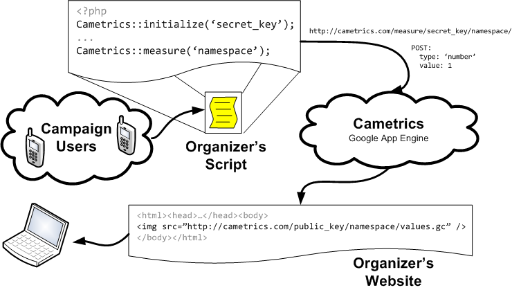
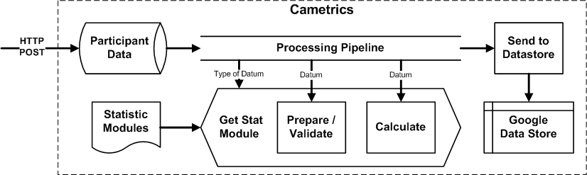

.. contents::

Cametrics: A Novel Data Logger, Aggregator, and Visualizer Cloud Service
------------------------------------------------------------------------
Olmo Maldonado, ibolmo@ucla.edu, UCLA Department of Electrical Engineering

Abstract
--------

Introduction
------------
In an environment that has limited resources, a constant usage of the system, and the time to deploy a new service is crucial for success; one cannot spend time or money to recreate or buy large systems just to begin a new project. Small ventures, prototypes, and personal web services live in this environment. The developers of these system work very closely on monitoring the system uptime, usage, and other measures that are important for performance and user experience improvements. 

The monitoring systems vary between implementation but most common is to measure a value as the system is running and to save the timestamp, value, and any context to a flat file or database on the same system. At some point, either scheduled or manually called, a separate program processes the logged files and can produce alerts, reports, or more additional measurements which are then used to make decisions on the system. 

This is an important feedback aspect of any system, and yet it is one of the hardest to reimplement in another project. This is due to varying codes, languages, system and time requirements. Furthermore, the organization of the data and the reports, and history, are easily lost between each project. One has to be familiar with each project to produce sensible and accurate metrics, as well as knowing where to insert the logging mechanisms. 

.. Not trying to save data, but create statistics

.. Need a transition to describe that it's hard to use these systems and that they're expensive -- in multiple forms.

#0 Describe participatory sensing systems. Rapid Development System

#1 This paper is not just about a system created to solve a problem in participatory sensing systems. This paper is about a system that can be used in any application that has access to the Internet. Cametrics is a system that compliments standard logging practices, and system, and can be used to readily give feedback to the user or system designers about performance, usability, or any measure that the developer sees fit for Cametrics to record and summarize. In this paper we cover the motivation, design, contributions, and conclusions of Cametrics. 

In participatory sensing, such an environment is the case. 

.. Participatory Sensing:
    Coordinated data gathering by individuals, groups, and communities to explore the world around them. 
    
    Taking participatory sensing from a possibility enabled by the mobile phone network to a coordinated reality remains a major challenge. 
    
.. Campaigns:
    Targeted and coordinated data collection efforts
    
.. Campaign Organizers:
    Anyone with an interest in coordinating a data-gathering campaign

Participatory Sensing
=====================
.. Use CHI paper

Campaigns
=========
.. Use CHI paper

Motivation
==========

Objectives
==========
Project objectives

---------------------------------------------------------------------------------------

Related Work
------------
There are plenty of services that have similarities with Cametrics. This is understandable. The design of Cametrics was driven to meet a large scope of requirements. At this time, there was no other service with similar goals and features as Cametrics. The following a table-summary of comparing various services that are accessible for anyone to use. Their aim is to provide their users with a personal tool used for introspection, socializing, or improve the representation of data with custom visualizations as created by the community. 

.. table:: Web Service Comparison against Cametrics

    +----------------------+----------+-------------+--------+-----------+----------+----------+-----------+
    | Critera              | ManyEyes | TrackNGraph | Swivel | Mycrocosm | Trendrr  | Timetric | Cametrics |
    +======================+==========+=============+========+===========+==========+==========+===========+
    | API                  | No       | No          | No     | No        | Yes      | Yes [#]_ | **Yes**   |
    +----------------------+----------+-------------+--------+-----------+----------+----------+-----------+
    | Schemaless           | No       | No          | No     | Yes       | No       | Yes      | **Yes**   |
    +----------------------+----------+-------------+--------+-----------+----------+----------+-----------+
    | Formless Setup       | No       | No          | No     | Yes       | Yes      | Yes      | **Yes**   |
    +----------------------+----------+-------------+--------+-----------+----------+----------+-----------+
    | Formless Entry       | No       | No          | No     | No [#]_   | Yes      | Yes      | **Yes**   |
    +----------------------+----------+-------------+--------+-----------+----------+----------+-----------+
    | Auto. Visual.        | No       | No          | Yes    | Yes [#]_  | Yes [#]_ | Yes [#]_ | **Yes**   |
    +----------------------+----------+-------------+--------+-----------+----------+----------+-----------+
    | Editable Data        | Yes      | Yes         | Yes    | Yes       | No [#]_  | Yes      | *Planned* |
    +----------------------+----------+-------------+--------+-----------+----------+----------+-----------+
    | Selectable Data [#]_ | No       | Yes         | Yes    | No        | No       | No       | *Planned* |
    +----------------------+----------+-------------+--------+-----------+----------+----------+-----------+
    | Shareable            | Yes [#]_ | Yes         | Yes    | Yes       | Yes      | Yes      | **Yes**   |
    +----------------------+----------+-------------+--------+-----------+----------+----------+-----------+
    | Aggregator           | No       | Yes         | Yes    | No        | No       | No       | **Yes**   |
    +----------------------+----------+-------------+--------+-----------+----------+----------+-----------+
    | Embeddable           | Yes      | Yes         | Yes    | Yes       | Yes      | Yes [#]_ | **Yes**   |
    +----------------------+----------+-------------+--------+-----------+----------+----------+-----------+

.. [#] Supports bulk uploads (csv), individual values, and increment decrement value. Access to data set with a hashed key.
.. [#] Mycrocosm uses a single input form field with a unique Domain-Specific-Language (DSL).
.. [#] Automatic visualization occurs for specific options and choices, selected by user.
.. [#] Only supports automatic visualization of a trend chart (line chart).
.. [#] Only supports automatic visualization of a trend chart (line chart).
.. [#] Data source property and delete of the data set are the only forms of data edit.
.. [#] This excludes datum selection (e.g. first, last, by specific timestamp)
.. [#] Note, in ManyEyes all data posted is shared publicly without the option for privacy.
.. [#] Embeds a flash object, which may not be available to the client browser

Criteria
========
The following defines the criteria evaluation.

API
    If the service provides a HTTP RESTful API (independent of the features the API supports).

Schemaless
    If the user, or developer of the system, does not have to define for a data set any unit, type, or attribution in order for the **backend** of the system to function appropiately.

Formless Setup
    If the user, or developer of the system, is not troubled to fill out a form on a website in order for the system to create a new data set, then we say that the system has a formless setup.

Formless Entry
    If the user of the system is not required to manually submit a form to enter a single value or a bulk of values.

Auto. Visual (Automatic Visualization)
    If the service automatically generates any form of visualization without the intervention of the user or developer.
    
Editable Data
    If the system allows at least edit or delete for a set or individual data.
    
Selectable Data
    If the system has the ability to return to the requestor a subset of the data (with the exception of single values -- first or last value, for instance).
    
Sharable
    If the system has the ability to share the data or visualization between an individual or a group of persons.
    
Aggregator
    If the system has the ability to summarize, or aggregate, the data submitted for statistical understanding. For example, for a number series if the system can return the maximum value passed, then the system passes the aggregator criteria.
    
Embeddable
    If the system has the ability to provide the user with a manner to publish to a website or to copy/paste some code into another website without any further user intervention.

ManyEyes [#]_
=============

ManyEyes, by the IBM's Visual Communication Lab, allows the community to take public data sets and visualize them from a slew of available visuals. Due their strong focus on visualizations, they have lacked support to many of the criteria. The social and the wide variety of visualization options, however, could and should be implemented in Cametrics in the future.

.. [#] http://manyeyes.alphaworks.ibm.com/manyeyes/

Track-n-Graph [#]_ and Swivel
=============================

Track-n-Graph and Swivel are tools to track anything about their lives and to make sense of data, respectively. Track-n-Graph and Swivel fail on similar criteria because they depend highly on user's input on the type, unit, and other attributes of the data set that is uploaded and visualized. All steps in the flow of the data the user has an critical role. Their lack of API, for instance, forces the users to go on to their web site to upload bulk sets of data and the user has to setup the schema of the data appropiately before any uploads can even begin. 

.. [#] http://www.trackngraph.com/www/
.. [#] http://www.swivel.com/

Mycrocosm [#]_
==============

Mycrocosm is a form of microblogging with the use of visualization. Assogba, et. al., had similar objectives with Mycrocosm as Cametrics. Mycrocosm attempts to reduce the time to report/collect the user data by simplifying the user interface to report new data to the system. To enter data a user follows a simple Domain Specific Language (DSL) to denote new data sets or new values for a data set. Furthermore, Mycrocosm appears to be schameless which has the added benefit of reducing the complexity of the DSL. For time inputs, for example, the user just has to have 'time' as part of the input string and the type of the data set is automatically associated with time intervals. Unfortunately, they do not have an API or an aggregation (summary) of the data passed to the data sets. 

.. [#] http://mycro.media.mit.edu/

Trendrr [#]_
============

Trendrr takes public data sources and creates trend lines from the data received. Trendrr has custom data input, but is limited to the allowed data types that can be passed. Trendrr also has restrictions on how to select or delete portions of the data. Otherwise, Trendrr follows similar features as Cametrics in that they support an API for client input. This allows a generic device to create a data source stream for *many* others to use the feed for their own purposes. 

.. [#] http://trendrr.com/

Timetric [#]_
=============

Timetric is a tool for visualizing statististical data. Timetric became very close to supporting most of the criterian that would satify the requirements for the project. Unfortunately, their focus of their service is strictly on time series events, in other words on number value inputs. Aggregation of the data is also an unsupported feature.

.. [#] http://timetric.com/

Cametrics
=========

As indidcated in the table, Cametrics is in the progress of adding selecting (including resolution support) of the data set. Moreover work is in progress to add the ability to delete specific data set or datum (with appropiate reductions in the summaries).

---------------------------------------------------------------------------------------

Contributions
-------------

.. Not trying to save data, but create statistics

.. sentence
..  Description of contribution

---------------------------------------------------------------------------------------

System Design
-------------

Design Principles
=================
The design of the system should support flexibility, accesability, and extensibility principles.

Flexibility
~~~~~~~~~~~
The developer should not have to learn a new language or have formal training on database system design to understand how to create or organize data sets. The system should conform to the developer's own concept of how the data is organized -- be it hierarchical or relational. Likewise, the system should encourage code reuse, simplicity (KISS), and intuitiveness when defining new data sets and recalling values or statistics from the system. Likewise the inputs should not be limited constricted to a set of allowed types.

Accessibility 
~~~~~~~~~~~~~
The system should be accessible programmatically and through an interface on a website. In either case, the system should have standard Create, Retrieve, Update, and Delete operations for all data sets, datum, and campaigns. The system should have a 99.9% up time and the responsiveness of the upload and download mechanisms of the site should be responsive so that systems that embeds or pushes data out and into the system are not bottlenecked by Cametrics.

Extensibility
~~~~~~~~~~~~~
Since campaigns are rapidly being deployed and user requirements per campaign fluctuate per client basis, the system has to have the ability to start with a base class of standard features but be able to support outside developement of the system. At each critical stage of the data flow from the input, to processing, to storage, to the retrieval, and the visualization should have a standard interface that a developer can use to subclass into a specific purpose that may not have been covered.

Platform Selection
==================
In selecting a platform to build Cametrics, one has a large variety of options that range from building your own personal framework, to using a framework, object relational model, and standard database, to finally using a cloud service like Amazon's EC2 or Google's AppEngine. Although there is great benefit, and practice, in creating your own framework or utilizing a known, and popular, framework solution which includes and ORM and a standard DB (which can then be deployed to Amazon's EC2) we found Google's App Engine to be most appropiate for the system.

Home Brew or Framework (Symfony, Doctrine, PostgreSQL) Solution
~~~~~~~~~~~~~~~~~~~~~~~~~~~~~~~~~~~~~~~~~~~~~~~~~~~~~~~~~~~~~~~
The strength in creating an in-house solution by starting from scratch or selecting from a popular solution such as Symfony [#]_, Doctrine [#]_, and PostgreSQL [#]_, is in the flexibility in owning your own system. There's no quota limit, no time limit (assuming you remove execution limit in the programming language configurations -- PHP's ``set_time_limit``, for example), and there's no unexpected platform limitations that we might encounter by using a specific version of a language or missing dependencies due to system security measures by the platform developers. And many more. There's less things that one will be surprised by.

The downfall of a home brew or even using popular frameworks is the lack of documentation. This is especially true for the home brew system. For the popular framework solution, it is less of a problem because the frameworks tend to have a large and active community to improve documentation and troubleshooting of the system usage and bugs. In both cases, however, there's a learning curve associated for someone that comes in to learn the system anew. Additionally there is no guarantee that the system is scalable or responsive. Due to the prototype nature of most projects, one cannot load the testing environment with stress tests or real world usage. On average, most systems have to go an extensive testing to then realize that a large portion of code worked but was extremely ineffective in terms of latency.

A counter argument would be to use Amazon's EC2 [#]_ to compliment the home brew or framework solution so that *becomes* scalable. In other words, use more resources only when necessary. While this may be true, we argue that the system is not scalable it simply was fed more fuel to consume. Using EC2 will not address the non-scalable portions of the system and will only accrue costs which will then make the service impossible to run for free or without support from the community.

.. [#] http://symfony-project.org/
.. [#] http://doctrine-project.org/
.. [#] http://postgresql.org/

Google's App Engine [#]_
~~~~~~~~~~~~~~~~~~~~~~~~
Almost the reciprocal of the previous platform considerations, Google App Engine has a standard look and feel. The platform runs under Python 2.5.2, and only Python. All necessary packages to run a full-fledge system is already included in the SDK and makes getting started a breeze. This should satisfy a concern that the system may become unmanagable between the number of administrators and developers that shift and join the team as the years and use of the system progresses. Furthermore, makes the distribution of "Cametrics" as an open source project more appealing for others to use for their own projects to host to other people, simpler to deploy than the aforementioned solutions.

The app engine also has a unique technology not common to the previous platforms: BigTable [BigTable]_. The BigTable has an interesting property that each entity (or record) is unique from each other. One record may have x-number of attributes (or columns) associated to the entity. This can differ from the kind (or table) definition that was defined in a model (schema) file. This is a very appealing property. One of the criteria discussed previously in the `Criteria`_ section is flexibility. If we are unconcerned of the columns that a record can hold then we can create an extensible module system that can "decorate" a record with varierty of information, data, or perhaps even references to other objects and open up an interface for developers to use.

We are also guaranteed that the system will be assesible and scalable. The deployed application Cametrics, will run on Google's infastructure and it is very unlikely that their systems will go down without anyone noticing. Outsourcing the maintenance of the system, is very appealing because this allows us to focus strictly on the code quality and usage of the system. The site is almost guaranteed to be scalable not because we are in the "cloud" but because we are forced to be scalable. Google has a 30 second deadline that if a script does not finish within 30 seconds all operations seize and a ``DeadlineExceptionError`` is raised and the system has to respond within a few seconds to handle the exception or the exception will terminate the running code. In the `Limitations and Requirements`_ we discuss other Google App Engine limitations and how they forced a specific manner of designing the internals of the system.

.. [#] http://code.google.com/appengine/
.. [BigTable] F. Chang, J. Dean, S. Ghemawat, W. C. Hsieh, D. A. Wallach, M. Burrows, T. Chandra, A. Fikes, and R. E. Gruber. BigTable: A distributed storage system for structured data. In Operating Systems Design and Implementation, 2006.

Limitations and Requirements
''''''''''''''''''''''''''''
Limits

Inputs
~~~~~~
As discussed in the `Flexibility`_ subsection, the allowed inputs to the system should have minimal restrictions and low number of requirements for the user can start to measure (log) data to the System. The formats allowed as inputs should also accept various popular formats like csv, json, or at the root of the allowed accepted values a simple ``POST`` with multiple or single value for the ``value`` field.

Required Outputs
~~~~~~~~~~~~~~~~
At a minimum, the system should return the logged data and any summaries/statistics that were computed as the data had arrived in the requested format provided by the user. Additional formats, or allowed outputs, should include images for Charts and JavaScript objects for easily populating a Google Maps API. These are the typical tools used by researchers to visualize statistical data as well as representing a location trace as a polyline or a series of of GMarkers for marking specific points in the path. As discussed, the output should support extensibility principle and have an accessible interface for a developer to contribute their own output format for others to use for their own projects. Moreover, the objects that can be selected for the output should be accessible without the use of a client software and to select the format of the output should not require the user to have a client for the system to return the data in the requested format.

Processing
~~~~~~~~~~
There are three processings that should occur: preparing, calulating, and visualizing the data. The prepare process should clean and validate the input to the system. The calculations that are executed, according to the type of data, should produce a summary of statistical information for that data. Lastly, the developer will use the summaries or the values of as they were logged or cleaned by the system and a visualization process should represent the data in the requested format and representation by the user or developer.

Proposed System
===============
Cametrics is the culmination of addressing all the previous design and user requirements. Cametrics provides other developers with a base class for Summaries, Rendering, and Visualizations which should cover most use cases but if necessary the system has the ability to accept developer contributed classes and should adapt naturally without internal modifications. Because the system runs in the Google App Engine, the system can be accessed with an uptime of at least 99.9% and the infastructure will scale (up to the quota limits) without system developer's intervention on the system. Furthermore, App Engine simplifies the deployment, development, and contributions of the system. The developmetn and external developer's contributions are simplified due to BigTable's unique property of having a flexible (schemaless) entity defintion which would allow entities (records) in the system to be decorated with additional attributes (columns) by the Summary modules that are applied to the type of data passed to the the system. Additional details of the running system in the `System Architecture`_ section of this paper.

---------------------------------------------------------------------------------------

System Architecture
-------------------
To best describe the architecture, we will use a concrete example. At this time a participatory sensing campaign, What's Invasive [#]_, is using Cametrics to provide the participants with feedback in the form of statistics of their number of contributions, the coverage of the area by the participants, the variety and quantity of the invasives that have been discovered, and more. The objective of the What's Invasive campaign is to empower the National Park Services in the Santa Monica Mountains with new tracking and discovery technology against invasive species. An invasive species is a species that is not indigenous in the area and that are consuming resources from native species.

Campaign participants run a campaign client called Campaignr [Campaignr]_, which posts sensor data (GPS, tags, and images) to an organizer's script on their web server. For demonstration purposes, the organizer's script is using the Cametrics PHP Client, but this step may have been unnecessary if the organizer had prepared the Campaignr client to post appropiately to the Cametrics server using HTTP methods. In the organizer's script, Cametrics is initialized with a ``secret key`` (given to the organizer when they author a campaign via the Cametrics website -- the only required step before they can begin using Cametrics). The organizer's script will process the data and call the static ``measure`` function to log a value to caemtrics. This value may be a number, string, location, datetime, and many more. See the discussion in the `Input Processing`_ subsection for more information. At the end of the PHP script, all the recorded data is ``POST``-ed to the Cametrics server. Cametrics then processes the input and calculates summaries which can be used immediately after the request. The organizer's website can then include the visualization by requesting to the Cametrics server for the namespace, path, and format of the data. For example in the following figure, the organizer's website is requesting that cametrics provide all the ``values`` that have been posted to the ``namespace`` entries with the ``gc`` (Google Charts API) format.

    
    An overview of a simple participatory sensing campaign using Cametrics.

.. [#] http://whatsinvasive.com/
.. [Campaignr] http://wiki.urban.cens.ucla.edu/index.php/Campaignr

Structure
=========

URI Format
~~~~~~~~~~
Cametrics follows a strict URI format/pattern that has the flexbility to access all the data sets stored as well as summaries and visualizations.

``.../namespace[/path[.format[?query_string]]]``
    
namespace:
    The namespace is synonymous to a nickname created by the organizer. This is contrary to timetric, trendrr, and other web services that allow the user to create their own data sets but for the user to access the data they are required to use a hashed key. The hashed key requires the organizer to keep a mapping file/script or to use the service's web site to associate a key to a data set. A namepspace textual it has representation and a meaning for the organizer. For example, a simple namespace of: ``'participant.visited'`` is easy to remember and understand. An interesting future work would be to relate data sets across multiple campaigns/projects by using the namespace and histogry of the namespace usage (formats requested, visualizations rendered, and most used objects of the data set).
    
    Even though the example states that the user can use ``participant.visited``, but correct to access the namespace with Cametrics is to convert any combination of non-alpha numerical character into a single ``/``. For example, ``participant.visited`` (as entered through the PHP client) would be accessed through HTTP with ``participant/visited``. This restriction may be removed in the future.
    
path:
    The path is an accessor mechanism into the data set. The path is best described a by a series of examples. Assuming the namespace is ``'participant.location'`` and type is ``'location'``, the path of ``values`` returns all the values stored on cametrics. The path of ``stats`` returned all the statistics calculated by the summary modules that matced the type of the data set. The path of ``stats/min.longitude`` returns a single longitude value (useful for bounding the data). Path of ``stats/geotudes/37561.91.68.99.62`` returns the totally number of GPS locations that are inside the Geotude [#]_ box (useful for understanding area coverage of the participant(s)). 
    
.. I may not be done explaining the path

format:
    The format mimics extensions in a file system. By appending a ``.json`` to a path, Cametrics returns a JSON [#]_ formatted object. The `Renderer`_ modules define supported formats (see subsection `Formats`_) for Cametrics and have a simple interface for an external developer to contribute their own formats. For the What's Invasive campaign, for instance, a request was made to support rendering location values into a Google Maps API [#]_ ready objects, such as polylines or markers. By overwriting a few of the base class ``Renderer`` I transformed the data from one representation (a Python dictionary) into a JavaScript string that uses the Google Map API's ``GMarker``, ``GLatLng`` and ``GPolyLine``.

query_string:
    The query string is the analogous of passing arguments to a function. Each argument is passed along the Render and Visuals and the Renderers and Visuals behave differently according the parameters that are passed. More documentation is available on the website, but as an example using the ``.gchart`` format and a ``query_string`` of: ``?cht=p3&chs=250x100&chco=054700`` informs the Google Chart Renderer that the object should be represented as a 3D-pie chart (``p3``), the size of the chart should be **250** by **150** pixels (``chs``), and the color of the chart (``chco``) should be **#054700**. Notice that the parameters are exactly as if someone was using the Google Chart API directly. The Google Chart formatter happens to generate a URL with the data (``chd``) and other data dependent parameters like the x- and y- labels. Having to provide a ``query_string`` is a bit convoluting, so most formatters have default options. A future work, would be to adjust the default parameters by how organizers (or participants) like to view their data.    
    
The following is a complete example of a possible URL that Cametrics supports: ``http://cametrics.appspot.com/measure/public_key/participant/visits/stats/weekday.gc?cht=bhs``. This will use the ``participant.visits`` namespace, and access the statistics (``stats``) calculated for all the datetime (defined in the statistic object, or the data) entries and return a stacked Google Chart's (``gc`` an alias for ``gchart``) bar graph of all the weekdays (Sunday through Saturday) that the participant has visited the website.

With exception of ``path`` and ``query_string``, Cametrics also uses the URI format to accept HTTP POST. For bulk uploads, Cametrics currently only accepts POSTs to an empty ``namespace``.

.. [#] http://www.geotude.com/about/nutshell
.. [#] http://www.json.org/
.. [#] http://code.google.com/apis/maps/

Modules
~~~~~~~

Formats
~~~~~~~

Client Libraries
================
At this time Cametrics has released a PHP client. Python and JavaScript clients are next to be released. The two main functions of the PHP library are ``initialize`` and ``measure``. The ``initialize`` function takes the secret key as given by the Cametrics website in the details of a campaign 

Input Processing
================

    
    An overview of the input processing pipeline as data is received by Cametrics.

Framework of Input Processing
~~~~~~~~~~~~~~~~~~~~~~~~~~~~~

Modalities
''''''''''

Output Generation
=================
Description

Framework of Output Processing
~~~~~~~~~~~~~~~~~~~~~~~~~~~~~~

Supported Output Formats
''''''''''''''''''''''''

---------------------------------------------------------------------------------------

Evaluation
----------

Quantitative
============

Latency
~~~~~~~

Subjective
==========

Survey
~~~~~~
Developer Survey

---------------------------------------------------------------------------------------

Conclusions
-----------

Success
=======

namespace:
    Intersting

Input Handling
==============

Performance
===========

Scalability
===========
Problems with scalability

---------------------------------------------------------------------------------------

Future Work
-----------
- Granularity
- Amount of data
- Filters (range)
- Summaries of Summaries
   - Automatically created "created_on" timestamp, should also be summarized
- Stream engine
- Study the usage of Cametrics
- Reduce the requirement of 'type' input

.. Directives
.. meta::
    :author: Olmo Maldonado
.. |published_date| date:: %B %d, %Y